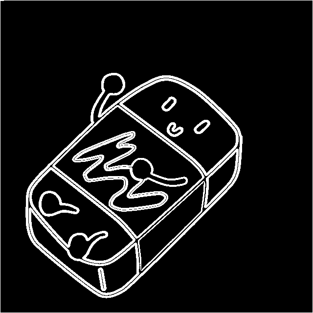

# Canny Edge Detection: An Overview

Canny Edge Detection is a sophisticated computer vision algorithm designed to extract sharp edges from an image while disregarding other details. The algorithm produces the following output:

    
    

# Implementation Details

The Canny edge detection algorithm involves applying a series of carefully chosen filters that work in tandem to achieve the desired output. These filters include:

- **Grayscale Conversion:** The grayscale filter transforms a color image into grey by converting each pixel's color value into a corresponding gray intensity value. This step is crucial because it simplifies the image to a single color channel, making it easier to detect edges based on intensity variations.
- **Gaussian Blur:** The Gaussian blur filter applies a blur to the grayscale image using a Gaussian kernel. This blurring process reduces noise and smoothens the image, which helps to eliminate small fluctuations in intensity that could be mistaken for edges. The amount of blurring is controlled by the size of the kernel and the standard deviation parameter.
- **Sobel Operator:** The Sobel operator is an edge-detection filter that calculates the gradient of the grayscale image in both the horizontal and vertical directions. It highlights regions of rapid intensity changes, representing potential edges. By computing the gradient magnitude and direction, the Sobel operator identifies the strength and orientation of edges in the image.
- **Double Thresholding:** Double thresholding is a technique where the image is segmented into different intensity regions based on two threshold values: a high threshold and a low threshold. Pixels with intensity values above the high threshold are considered strong edges, while those below the low threshold are regarded as non-edges. Pixels with values between the two thresholds are classified as weak edges.
- **Hysteresis Thresholding:** Hysteresis thresholding is the final step in the Canny edge detection process. It aims to refine the edges obtained from double thresholding by connecting and preserving only the strong edges while suppressing weak or noisy edges. It achieves this by analyzing the connectivity between pixels and determining if they form continuous edge contours.

# Getting Started

To utilize this code for applying Canny edge detection to your own images, follow the steps below:

- Clone the repository: git clone https://github.com/Dan-Swarts/Canny_Edge_Detection.git
- Compile the code using the provided makefile: make
- Place your input image in the "images" folder within this repository
- Run the script: ./image_processor input.jpg canny-edge-detect output.jpg
- You are free to use any image of your choice
- Please note that this implementation assumes you have a basic understanding of computer vision concepts and have the necessary environment set up to run the code. Ensure that the required dependencies are installed and configured properly.

For more information and detailed instructions, please refer to the project repository's documentation.

Should you have any questions or encounter any issues, feel free to reach out for assistance.